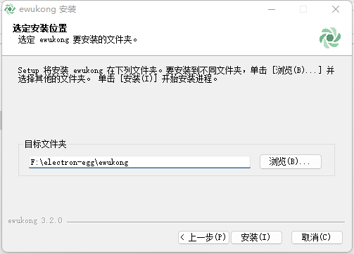
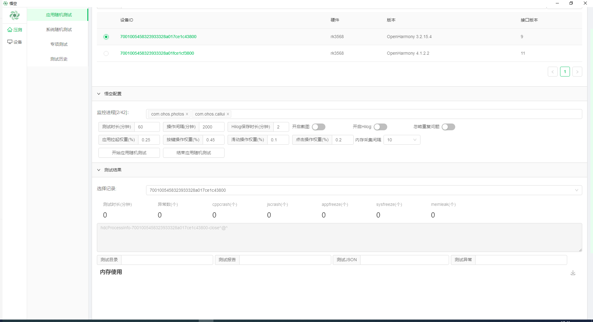

# elec_wukong

#### Description
elec_wukong is a pressure testing application developed and generated based on electron Eggs, used for stability pressure testing of equipment. The application functions include application random testing, system random testing, special testing, and viewing test history.

#### Software Architecture
This application has four sub functional pages, namely application random testing, system random testing, special testing, and testing history.

The application random testing page simulates the user's operational behavior, conducts long-term and high-frequency stress testing on a specified application, and collects fault problems and related positioning information that occur during that period to assist device developers in evaluating and optimizing the robustness of the application. This testing service provides multiple algorithms to construct random operation behavior. To achieve comprehensive coverage of the internal interface of the application as much as possible, and to expose the stability issues of the application in the era as much as possible.

The system traversal test page simulates the user's operational behavior, conducts long-term and high-frequency stress testing on the entire device system, and collects fault problems and related positioning information of the device to assist developers in evaluating and optimizing the overall stability of the device system. This testing service provides multiple algorithms to construct random operation behavior, achieving coverage of various usage scenarios and applications of the entire machine, so as to expose system stability issues as much as possible.

The special testing page collects fault problems and related positioning information of equipment during typical usage scenarios through continuous high-frequency stress testing, to assist equipment developers in evaluating and optimizing the stability of the equipment in this scenario. The typical scenarios supported by this testing service include special tests such as sleep wake-up, controls, sliding, and clicking.

Test History Page: Records the history of users conducting stress tests, making it easy for developers to view historical issues.

#### Developer tutorial

**(Steps 1-4 are commands for configuring and running the project; steps 5-6 are commands for publishing packaged projects)**

1. Install node.js using NVM. Download link：[nvm文档手册 - nvm是一个nodejs版本管理工具 - nvm中文网 (uihtm.com)](https://nvm.uihtm.com/)

   Run the following command:

   ~~~
   1. nvm node_mirror https://npmmirror.com/mirrors/node/
   2. nvm npm_mirror https://npmmirror.com/mirrors/npm/
   3. nvm install 16.9.1
   4. nvm use 16.9.1   (Update nodejs based on the requirements for the nodejs version when running the electron Egg project in the future)
   ~~~

2. Download the code for this project using Git. Run the following command:

   ~~~
   git clone https://gitee.com/wshikh/elec_wukong.git
   ~~~

3. Set up the image and npm install it. Run the following command:

   ~~~
   npm config set registry=https://registry.npmmirror.com
   npm config set disturl=https://registry.npmmirror.com/-/binary/node
   npm config set electron_mirror=https://registry.npmmirror.com/-/binary/electron/
   ~~~

   Enter the project and run the following command: **(npm install needs to be run once in the root directory and once in the frontend directory)**

   ~~~
   root directory： npm install
   cd frontend    npm install
   ~~~

4. Start the project and run the following command: (Run the A or B command in the project root directory

   ~~~
   A cold start: cd frontend    npm run serve;    root directory: npm run dev
   B has started serve,only starting electron:  root directory: npm run dev
   ~~~

5. Pre release mode, testing for normal functionality. Run the following command from the root directory:

   ~~~
   npm run start
   ~~~

6. pack

   ~~~
   1. build the front-end resource     root directory: cd frontend    npm run build
   2. mobile front-end resource file   root directory: npm run rd
   3. modify the name attribute in package.json in the root directory of the project name location
   4. set image：    npm config set electron_ Builder_ Binaries_ Mirror= https://registry.npmmirror.com/-/binary/electron-builder-binaries/
   5. formal packaging root directory: npm run build w-64 (If you need to package as an installation file for another system, the parameters are in the build - in the scripts attribute of package. json in the root directory)
   ~~~

7. achievement

   Find the packaged program at the following path, which is the installation package

   ~~~
   ./elec_wukong/src/out/ewukong-win-3.2.0-x64.exe
   ~~~

   Find the packaged program folder at the following path, and the executable files in this folder are the program startup files

   ~~~
   ./elec_wukong/src/out/win-unpacked
   ~~~

8. Open elec_wukong application; Select the type of pressure measurement; Select the device ID and set the pressure measurement configuration; Start pressure testing

   

#### Tutorial for ordinary users

1.  Download the library code to the local computer. 

    ~~~
    git clone https://gitee.com/wshikh/elec_wukong.git
    ~~~

2.  Click on the installation file：ewukong-win-3.2.0-x64.exe。Path is  elec_wukong\src\out\ewukong-win-3.2.0-x64.exe

    

3.  Select user Installation

    

4.  Select the installation path for installation

    

5.  Open elec_wukong application

    

6.  Select the type of pressure measurement; Select the device ID and set the configuration for pressure testing

7.  Start pressure testing
