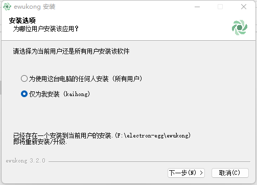
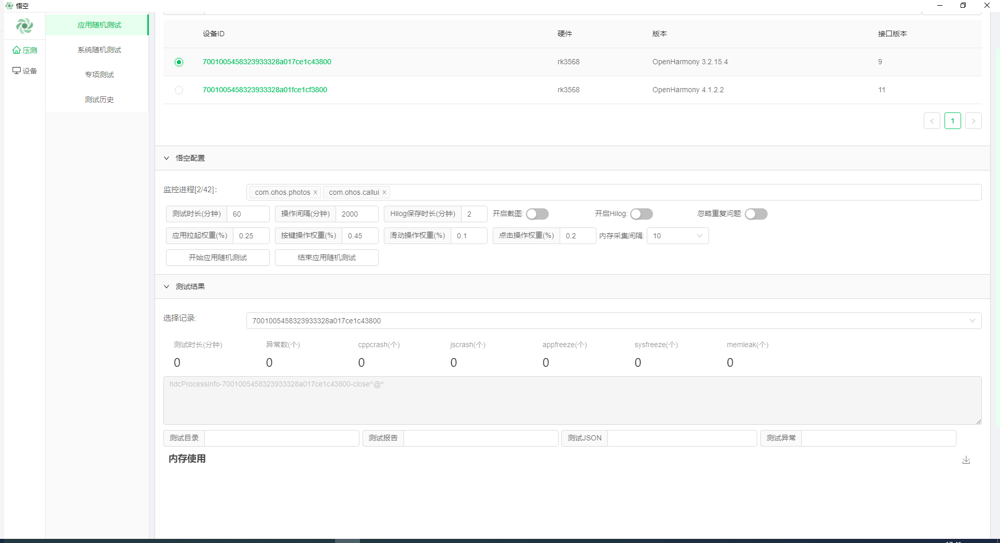
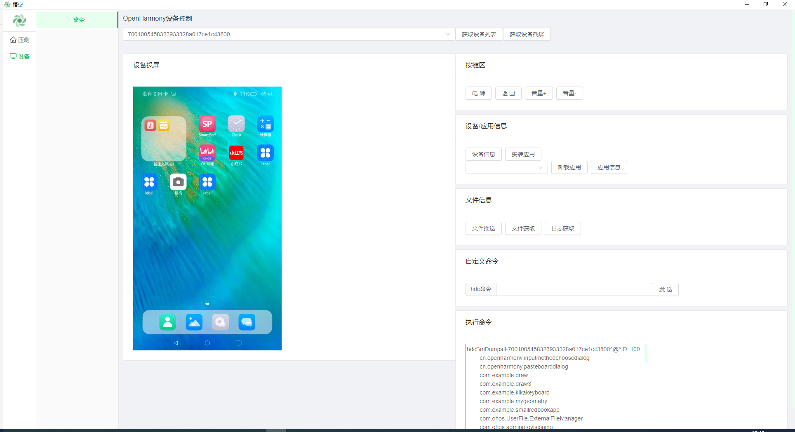

# elec_wukong

#### 介绍
elec_wukong是一款基于electron-egg开发生成的压测应用，用于设备的稳定性压力测试。应用功能有应用随机测试，系统随机测试，专项测试和查看测试历史。

#### 软件架构
本应用有四个子功能页面，分别为应用随机测试，系统随机测试，专项测试和测试历史。

应用随机测试页面，是通过模拟用户的操作行为，对指定应用进行长时间、高操作频率的压力测试，并收集该期间设备发生的故障问题和相关定位信息，来辅助设备开发者来评估和优化应用的健壮性。本测试服务提供多种算法来构建随机操作行为。实现对应用内界面尽可能全面覆盖，时代的应用稳定性问题能尽可能地暴露。

系统遍历测试页面，是通过模拟用户的操作行为，对设备整机系统进行长时间、高操作频率的压力测试，并收集该器件设备发生的故障问题和相关的定位信息，来辅助开发者评估和优化设备系统整体的稳定性。本测试服务提供多种算法来构造随机操作行为，实现对整机的各种使用场景、各类应用的覆盖，使得系统稳定性问题能尽可能地暴露。

专项测试页面，是通过对设备的一些典型使用场景进行连续高频次的压力测试收集该期间设备发生的故障问题和相关定位信息，来辅助设备开发者评估和优化设备在该场景下的稳定性。本测试服务支持的典型场景包括休眠唤醒、控件、滑动、点击等专项测试。

测试历史页面：记录使用者进行压力测试的历史记录，方便开发者查看历史问题。

#### 开发者使用教程

**（步骤1-4为配置及运行项目的命令；步骤5-6为发布打包项目的命令）**

1. 用nvm安装node.js。下载链接：[nvm文档手册 - nvm是一个nodejs版本管理工具 - nvm中文网 (uihtm.com)](https://nvm.uihtm.com/)

   运行以下命令：

   ~~~
   1. nvm node_mirror https://npmmirror.com/mirrors/node/
   2. nvm npm_mirror https://npmmirror.com/mirrors/npm/
   3. nvm install 16.9.1
   4. nvm use 16.9.1   (后续根据运行electron-eggs项目时对nodejs版本的要求，对nodejs进行更新)
   ~~~

2. 使用git下载本项目代码。运行以下命令：

   ~~~
   git clone https://gitee.com/wshikh/elec_wukong.git
   ~~~

3. 设置镜像并npm install。运行以下命令：

   ~~~~
   npm config set registry=https://registry.npmmirror.com
   npm config set disturl=https://registry.npmmirror.com/-/binary/node
   npm config set electron_mirror=https://registry.npmmirror.com/-/binary/electron/
   ~~~~

   进入项目，运行以下命令：**(npm install要在根目录和frontend目录分别运行一次)**

   ~~~
   根目录 npm install
   cd frontend    npm install
   ~~~

4. 启动项目，运行以下命令：（在项目根目录运行A或B命令）

   ~~~
   A冷启动： cd frontend    npm run serve;      根目录:npm run dev
   B已启动serve，只启动electron:  根目录:npm run dev
   ~~~

5. 预发布模式，测试功能是否正常。根目录运行以下命令：

   ~~~
   npm run start
   ~~~

6. 打包

   ~~~
   1. 构建前端资源    根目录:cd frontend     npm run build
   2. 移动前端资源文件  根目录: npm run rd（手动拷贝frontend下的dist到根目录里的dist）
   3. 修改项目名称  位置在根目录下的package.json中的name属性
   4. 设置镜像     npm config set electron_builder_binaries_mirror=https://registry.npmmirror.com/-/binary/electron-builder-binaries/
   5. 正式打包  根目录: npm run build-w-64 (如需打包为其他系统的安装文件，参数在根目录下package.json中scripts属性中的 build-)
   ~~~

7. 成果

   在以下路径找到打包好的程序，此文件为安装包

   ~~~
   ./elec_wukong/src/out/ewukong-win-3.2.0-x64.exe
   ~~~

   在以下路径找到打包好的程序文件夹，此文件夹中的可执行文件即程序启动文件

   ~~~
   ./elec_wukong/src/out/win-unpacked
   ~~~

8. 打开elec_wukong应用；选择压测类型；选择设备ID，设置压测的配置；开始压测

#### 普通用户使用教程

1.  下载本仓代码到本地电脑。

    ~~~
    git clone https://gitee.com/wshikh/elec_wukong.git

2.  点击安装文件ewukong-win-3.2.0-x64.exe。路径为：elec_wukong/src/out/ewukong-win-3.2.0-x64.exe

    

3.  选择用户安装

    

4.  选择安装路径，进行安装

    

5.  自动化测试，选择压测类型；选择设备ID，设置压测的配置，进行压测

    

6.  设备控制，选择设备，点击图片控制设备，其他命令可以获取信息并显示在执行命令框

    

